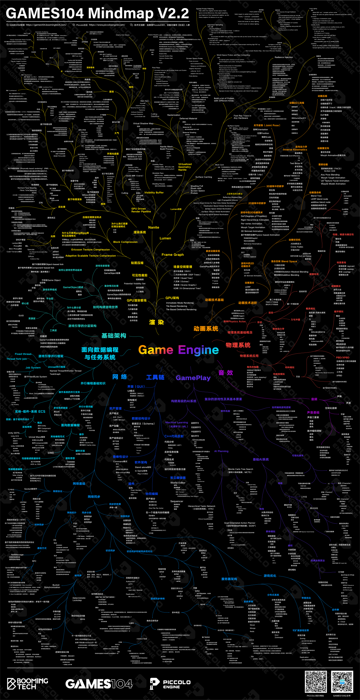

# Obsidian-Vault
Volleier的笔记储存仓库📓
> 及时当勉励，岁月不待人
# 内容
## 计算机科学与技术
### 理论基础

### 领域技术

### 横向能力

### 原子笔记

## 技术美术
### 理论基础于核心思维

### 专业技能与工具链

### 管线与工作流

### 项目实战库

### 资源引用

### 原子笔记库

## 人工智能
### 基础基石

### 核心理论

### 技术栈

### 应用领域

### 原子笔记库

## 虚幻引擎

## 游戏设计

## 杂项

## Markdown语法

# 参考
- 李宏毅的机器学习课程[【授权】李宏毅2023春机器学习课程](https://www.bilibili.com/video/BV1TD4y137mP/?spm_id_from=333.1007.top_right_bar_window_custom_collection.content.click&vd_source=57895bcd39cfbda6e6de768d195f104c)

- 虚幻社区经理大钊老师的文章，深入浅出解析虚幻引擎[InsideUE5 - 知乎](https://www.zhihu.com/column/insideue4)

- 虚幻引擎学习路线图，细节稍有出入，但是作为总览是很不错的

# 许可证

本笔记本内容采用 [知识共享署名-非商业性使用-相同方式共享 4.0 国际许可协议](https://creativecommons.org/licenses/by-nc-sa/4.0/) 进行许可。