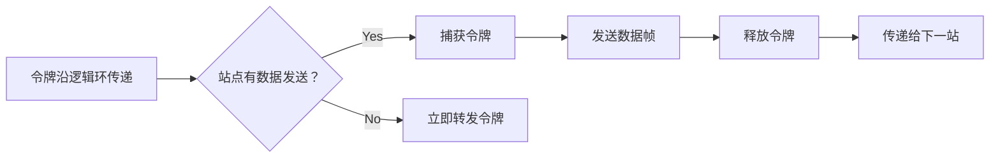

**数据链路层**（Data Link Layer）是[[OSI七层模型|OSI模型]]第二层，位于[[Physical Layer 物理层|物理层]]与[[Network Layer 网络层|网络层]]间。在广播式多路访问链路中（局域网），由于可能存在介质争用，它还可以细分成[介质访问控制]（MAC）子层和[逻辑链路控制]（LLC）子层，介质访问控制（MAC）子层专职处理介质访问的争用与冲突问题。

# 数据链路层总览
## 基本功能
数据链路层主要功能包括：将数据打包成帧、用MAC地址寻址、检测传输错误、控制数据流量。常见协议有以太网和Wi-Fi，典型设备是交换机。

常见概念：
- 帧（Frame）的封装与解封装：将网络层的数据包封装成帧，添加头部和尾部信息。
- 物理寻址：通过MAC地址标识设备。
- 差错控制：检测或纠正传输中的错误（如CRC校验）。
- 流量控制：协调发送方和接收方的速率（如滑动窗口协议）。
- 介质访问控制（MAC）：解决共享信道中的冲突问题（如以太网的CSMA/CD）。

## 组帧（成帧）
数据链路层的组帧（成帧）主要有字符计数法、字符填充法、比特填充法、物理层编码违例法

这是对比：

| 方式             | 标志类型     | 填充/转义机制      | 适用场景                 | 主要缺点               |
| ---------------- | ------------ | ------------------ | ------------------------ | ---------------------- |
| 字符计数法       | 长度字段     | 无                 | 早期协议（如DDCMP）      | 计数错误导致灾难性后果 |
| 字符填充法       | 控制字符     | 插入ESC转义字符    | 文本传输（如PPP）        | 不适用于二进制数据     |
| 比特填充法       | 比特模式     | 插入"0"避免连续"1" | 二进制数据（如HDLC）     | 硬件实现复杂           |
| 物理层编码违例法 | 非法电平信号 | 无                 | 特定物理层（如曼彻斯特） | 依赖物理层编码         |

### 字符计数法（Character Count）

#### 原理
在帧的起始位置使用一个固定长度的字段（通常是1-2字节）来记录整个帧的字节数。
接收方根据该计数字段确定帧的结束位置。

#### 示例
```text
[长度:5][数据:HELLO][长度:8][数据:NETWORK]...
```
第一帧：长度=5，数据="HELLO"
第二帧：长度=8，数据="NETWORK"

#### 特点
- 优点：实现简单，无需填充或转义字符。
- 缺点：
    - 如果计数字段出错（如传输错误），后续所有帧都会错位（**灾难性错误传播**）。
    - 帧长度受限（取决于计数字段的位数）

### 字符填充法（Character Stuffing）
#### 原理
使用特定的控制字符作为帧的起始（STX，ASCII 0x02）和结束（ETX，ASCII 0x03）标志。
若数据中出现控制字符，则插入转义字符（ESC，ASCII 0x1B）进行填充。
接收方删除转义字符恢复原始数据。
#### 示例
- 帧格式：`STX [数据] ETX`
- 数据中包含`ETX`时：  
    原始数据：`A ETX B` → 填充后：`STX A ESC ETX B ETX`

#### 特点
- 优点：适合文本传输（如ASCII协议）。
- 缺点：
    - 依赖特定字符集（如ASCII），不适用于二进制数据。
    - 转义字符本身也需要处理（若数据中出现ESC，需双重转义）。

### 比特填充法（Bit Stuffing）
#### 原理：
使用特定的比特模式作为帧边界（如HDLC协议使用`01111110`作为帧首尾标志）。
发送方在数据中遇到连续5个"1"时，自动插入一个"0"（避免与标志混淆）。
接收方删除插入的"0"恢复原始数据。

#### 示例
- 标志：`01111110`
- 原始数据：`01111111`（连续6个"1"）→ 填充后：`011111011`（在第5个"1"后插入"0"）
    
#### 特点
- 优点
    - 适用于二进制数据，效率高于字符填充法。
    - 广泛用于现代协议（如HDLC、以太网）。
- 缺点：硬件实现稍复杂（需比特级操作）。

### 物理层编码违例法（Physical Layer Violation）
#### 原理
利用物理层编码规则中未使用的信号状态（如曼彻斯特编码中的高-高或低-低电平）作为帧界。
无需在帧中添加额外的标志位。

#### 特点
- 优点：节省带宽（无需显式添加帧标志）。
- 缺点：
    - 依赖特定物理层编码方式（如曼彻斯特编码）。
    - 现代高速网络较少使用。

# 差错控制
| 方法     | 功能       | 复杂度 | 适用场景                    |
| -------- | ---------- | ------ | --------------------------- |
| 奇偶校验 | 单比特检错 | 低     | 低速通信、内存校验          |
| CRC      | 多比特检错 | 中     | 网络协议、存储系统          |
| 海明码   | 检错+纠错  | 高     | 需要纠错的场景（如ECC内存） |
## 检错编码

### 奇偶校验码
奇偶校验法（Parity Check）是一种简单的错误检测方法，主要用于验证数据在传输或存储过程中是否出现错误。其核心思想是通过增加一个冗余位（奇偶校验位），使数据中“1”的个数满足奇偶性（奇数或偶数）的预设规则。
- 优点：
    - 简单高效，硬件实现成本低。
    - 适用于少量错误检测（如单比特错误）。
- 缺点：
    - 只能检测奇数个比特错误（若两位同时出错，无法发现）。
    - 无法纠正错误，仅能提示错误存在。
    - 不适用于高噪声环境或高可靠性需求场景。

#### 基本原理
1. 奇校验（Odd Parity）：确保数据（包括校验位）中“1”的总数为奇数。
2. 偶校验（Even Parity）：确保数据（包括校验位）中“1”的总数为偶数。

#### 实现步骤
发送端：
- 计算原始数据中“1”的个数。
- 根据校验类型（奇/偶）添加校验位：
	- 若为偶校验且“1”的个数已为偶数，校验位为`0`；否则为`1`。
	- 若为奇校验且“1”的个数已为奇数，校验位为`0`；否则为`1`。
- 发送数据时附带校验位。
接收端：
- 接收数据后，重新计算“1”的个数（包括校验位）。
- 检查是否满足预设的奇偶性：
	- 若满足，认为数据正确。
	- 若不满足，判定数据存在错误。

#### 示例
假设传输数据 `1011`，采用偶校验：
- 原始数据中“1”的个数为3（奇数），故校验位为`1`，使总“1”数变为4（偶数）。
- 发送完整数据：`1011` + `1` → `10111`。
- 接收端检测到“1”的个数为4（偶数），则判断无错误。

### 循环冗余校验码
循环冗余校验码（CRC） 是一种广泛使用的错误检测编码，通过多项式除法计算校验值，能够高效地检测数据传输或存储中的错误（如比特翻转、突发错误等）。其核心思想是将数据视为二进制多项式，通过模2除法生成冗余校验码。
- CRC通过多项式除法生成校验码，是高效可靠的检错方法。
- 适用于对错误敏感但无需纠错的场景（如网络传输）。
- 实际应用中需根据需求选择生成多项式（如CRC-16、CRC-32）。

优点：
- 高检错能力：可检测所有单比特错误、双比特错误、奇数位错误及突发错误（突发长度 ≤ CRC位数）。
- 高效：硬件实现简单（移位寄存器+异或门）。
- 广泛应用：网络通信（Ethernet、Wi-Fi）、存储系统（ZIP、RAID）、文件传输（FTP）等。
缺点：
- 仅能检错，无法纠错：需结合其他机制（如重传）修复错误。
- 无法对抗故意篡改：CRC非加密算法，不适用于安全校验。

#### 基本原理
1. 数据多项式：将待传输的二进制数据表示为多项式（如 `1011` → x3+x+1x3+x+1）。
2. 生成多项式：收发双方预先约定一个固定多项式（如CRC-8、CRC-16等），用于计算校验码。
3. 模2除法：数据多项式除以生成多项式，得到的余数即为CRC校验码。
4. 校验过程：接收方用相同方法计算CRC，若余数为0则数据正确，否则存在错误。

#### CRC计算步骤
发送端：生成CRC校验码
1. 数据扩展：在原始数据末尾补 nn 个0（nn 为生成多项式的最高次幂）。
    - 例如：数据 `1101`，生成多项式 x3+x+1x3+x+1（对应 `1011`），补3个0 → `1101000`。
2. 模2除法：用扩展后的数据除以生成多项式（按位异或运算）。
    - 除法过程忽略借位，每一步用生成多项式对齐当前最高有效位进行异或。
3. 获取余数：除法的余数即为CRC校验码（位数=生成多项式位数-1）。
4. 附加校验码：将余数替换到原始数据补0的位置，得到最终发送数据。

接收端：校验数据
1. 用接收到的数据（含CRC）除以相同的生成多项式。
2. 若余数为0，数据正确；否则存在错误。

#### 示例
##### 假设：
- 原始数据：`1101`
- 生成多项式：x3+x+1x3+x+1（二进制 `1011`）

##### 发送端计算CRC：
- 数据补3个0 → `1101000`。
- 模2除法：
```text
       1101000 (数据)
     ⊕ 1011    (生成多项式对齐最高位)
       -----
        011000
      ⊕ 1011
        -----
         1110
       ⊕ 1011
         -----
          1010
        ⊕ 1011
          -----
           001 (余数=CRC= `001`)
```
- 发送数据：原始数据 + CRC = `1101` + `001` → `1101001`。

##### 接收端验证：
用 `1101001` 除以 `1011`，余数为0则无误。
#### 常见生成多项式

| 标准   | 多项式（二进制）                    | 用途                  |
| ------ | ----------------------------------- | --------------------- |
| CRC-8  | `100000111`                         | 简单通信（如I2C总线） |
| CRC-16 | `11000000000000101`                 | Modbus、USB设备       |
| CRC-32 | `100000100110000010001110110110111` | ZIP、PNG、以太网      |

## 纠错编码
### 海明码
海明码是一种经典的错误检测与纠正编码（EDAC, Error Detection and Correction），由理查德·海明（Richard Hamming）于1950年提出。它通过在数据位中插入多个校验位，不仅能检测错误，还能精确定位并纠正单比特错误（或检测双比特错误），广泛应用于内存（如ECC RAM）、通信系统等领域。
- 海明码通过巧妙的校验位分布和奇偶校验关系，实现单比特错误的检测与纠正。
- 冗余度低（仅需 log⁡2(k)log2​(k) 位校验位），适合高可靠性场景。
- 是理解现代纠错编码（如Reed-Solomon、LDPC）的基础。

核心思想：
1. 校验位分布：将校验位插入到数据位的特定位置（位置号为2的幂次方，如1, 2, 4, 8…）。
2. 奇偶校验分组：每个校验位负责覆盖部分数据位，通过奇偶校验关系建立关联。
3. 错误定位：通过校验位的组合结果（称为综合征/Syndrome）直接定位错误位。

#### 编码步骤
##### 确定校验位数量
若原始数据位数为 kk，校验位数为 rr，需满足：$2r≥k+r+12r≥k+r+1$
例如：
- 对4位数据（如 `1011`），需3位校验位 $（2^3=8≥4+3+1）$。
- 对11位数据，需4位校验位$（2^4=16≥11+4+1）$。

##### 插入校验位
校验位的位置为$2^{i−1}$  （即第1, 2, 4, 8…位），数据位填充其余位置。  
**示例**：对4位数据 `D3 D2 D1 D0`（`1011`），插入校验位 `P2 P1 P0`后的7位编码：
```text
位置： 7 6 5 4 3 2 1  
数据：D3 D2 D1 P2 D0 P1 P0  
填充后：1 0 1 _ 1 _ _  
```

##### 计算校验位
每个校验位 PiPi​ 覆盖位置号二进制表示中第 ii 位为1的数据位：
- P0（位置1）：覆盖所有位置号末位为1的位（1, 3, 5, 7…）。
- P1（位置2）：覆盖所有位置号倒数第二位为1的位（2, 3, 6, 7…）。
- P2（位置4）：覆盖所有位置号倒数第三位为1的位（4, 5, 6, 7…）。

计算示例（偶校验）：
- P0 = D0 ⊕ D1 ⊕ D3 = 1 ⊕ 1 ⊕ 1 = 1
- P1 = D0 ⊕ D2 ⊕ D3 = 1 ⊕ 0 ⊕ 1 = 0
- P2 = D1 ⊕ D2 ⊕ D3 = 1 ⊕ 0 ⊕ 1 = 0  
    最终编码：`1 0 1 0 1 0 1`（位置7→1）。

#### 解码与纠错

##### 计算综合征（Syndrome）
接收方重新计算各校验位的奇偶性，将结果按 P2P1P0P2P1P0 顺序组合为二进制数，其值直接指示错误位置（若为0则无错误）。
- 单比特错误：可检测并纠正。
- 双比特错误：可检测但无法纠正（需扩展海明码）。
- 多比特错误：可能漏检。

示例：假设接收到的数据为 `1 0 1 0 1 1 1`（第2位出错）：
- P0_new = 1 ⊕ 1 ⊕ 1 ⊕ 1 = 0（原P0=1，不一致）
- P1_new = 1 ⊕ 0 ⊕ 1 ⊕ 1 = 1（原P1=0，不一致）
- P2_new = 1 ⊕ 0 ⊕ 1 = 0（原P2=0，一致）  
    综合征：S=P2P1P0=011S=P2P1P0=011（二进制3），表示第3位出错。

##### 纠正错误
翻转错误位（第3位）：`1 0 1 0 1 1 1` → `1 0 0 0 1 1 1`（恢复正确数据）。

#### （扩展）海明码的变种
- 扩展海明码（SEC-DED）：增加一个全局奇偶校验位，可检测双比特错误并纠正单比特错误（用于ECC内存）。
- 海明距离：编码理论中衡量纠错能力的基础概念（海明码的最小距离为3）。

# 流量控制与可靠传输

## 基础机制

### 流量控制（Flow Control）
通过接收方反馈机制动态调整发送方的发送速率，达到防止发送方发送数据过快，导致接收方缓冲区溢出。  

实现方式：
1. 停等协议（Stop-and-Wait）：
    - 发送方每发送一个数据包，需等待接收方的确认（ACK）后再发送下一个。
    - 缺点：信道利用率低（尤其在长延迟网络中）。
2. 滑动窗口协议（Sliding Window）：
    - 允许发送方连续发送多个数据包（窗口大小内的数据），无需逐个等待ACK。
    - 接收方通过窗口通告（Window Advertisement）告知剩余缓冲区大小。

### 可靠传输（Reliable Transmission）
确保数据无差错、不丢失、不重复且按序到达。  
关键技术：
- 确认应答（ACK/NACK）：接收方反馈数据接收状态。
- 超时重传（Retransmission Timeout, RTO）：未收到ACK时重发数据。
- 序号机制（Sequence Number）：标识数据包顺序，解决乱序和重复问题。

经典协议：
- ARQ（Automatic Repeat Request）：
    - 停等ARQ：基于停等协议，每个包需单独确认。
    - 回退N帧（Go-Back-N, GBN）：
        - 发送方窗口大小为 NN，若某个包超时，重发该包及其后所有包。
        - 缺点：效率低（即使后续包已正确接收，仍需重传）。
    - 选择重传（Selective Repeat, SR）：
        - 仅重传丢失或错误的包，接收方缓存乱序包。
        - 优点：高效，但实现复杂（需维护多个包的ACK状态）。

### 滑动窗口机制（Sliding Window Protocol）
同时实现流量控制和可靠传输，通过动态窗口调整平衡效率与可靠性。

核心概念：
- 发送窗口（Send Window, SWND）：发送方允许连续发送的未确认数据包范围。
- 接收窗口（Receive Window, RWND）：接收方缓冲区剩余容量（通过ACK告知发送方）。
- 拥塞窗口（Congestion Window, CWND）：受网络拥塞状况影响的窗口（见TCP拥塞控制）。

工作流程：
1. 发送方：
    - 初始化窗口大小（如RWND和CWND的最小值）。
    - 发送窗口内的数据包，并启动定时器。
    - 收到ACK后，窗口向前滑动，继续发送新数据。
    - 若超时未收到ACK，触发重传（GBN或SR策略）。
2. 接收方：
    - 按序接收数据包，发送累积ACK（如TCP）或选择性ACK（如SACK）。
    - 通过ACK报文通告当前RWND（流量控制）。

示例：
```text
发送方窗口：[1, 2, 3] → 发送包1,2,3
接收方ACK 1 → 窗口滑动至[2, 3, 4] → 发送包4
接收方ACK 2 → 窗口滑动至[3, 4, 5] → 发送包5
```

#### TCP中的滑动窗口
TCP将流量控制（接收方窗口RWND）和拥塞控制（拥塞窗口CWND）结合，动态调整发送窗口： $发送窗口=min⁡(RWND,CWND)$
- 优点：
	- 提高信道利用率（允许并发传输）
	- 动态适应接收方处理能力（流量控制）
	- 支持可靠传输（ARQ机制）
- 缺点
	- 实现复杂（需维护窗口状态和定时器）
	- 窗口大小需合理设置（过大导致拥塞）
	- 乱序处理增加开销（如SACK）

关键机制：
- 累积确认（Cumulative ACK）：ACK号为按序接收的最后一个字节序号+1。
- 快速重传（Fast Retransmit）：收到3个重复ACK时立即重传（无需等待超时）。
- 选择性确认（SACK）：可选扩展，精确通知丢失的包范围。

## 具体协议
三种协议的信道利用率分析：
以下是对比：

| 特性         | 停止-等待协议                                   | 后退N帧协议（GBN）                   | 选择重传协议（SR）                |
| ------------ | ----------------------------------------------- | ------------------------------------ | --------------------------------- |
| 发送窗口大小 | 1                                               | $N（≥1）$                            | $N$（通常 $N≤2k−1$）              |
| 接收窗口大小 | 1                                               | 1                                    | $N$（缓存乱序包）                 |
| ACK机制      | 单个ACK（确认1个包）                            | 累积ACK（确认连续按序包）            | 选择性ACK（SACK，确认任意正确包） |
| 重传策略     | 超时重传当前包                                  | 重传所有未确认包（从最早丢失包开始） | 仅重传丢失或超时的包              |
| 定时器管理   | 单个定时器（当前包）                            | 单个定时器（窗口最左侧包）           | 每个数据包独立定时器              |
| 乱序包处理   | 丢弃（不缓存）                                  | 丢弃（不缓存）                       | 缓存并发送SACK                    |
| 信道利用率   | 极低$(U = \frac{T_{data}}{T_{data}+2T_{prop}})$ | 中等（依赖窗口大小 $N$）             | 高（接近理论最优）                |
| 实现复杂度   | 非常简单                                        | 简单                                 | 复杂（需管理多个定时器和缓存）    |
| 优点         | 实现简单，适合低速率网络                        | 减少等待时间，提高吞吐量             | 高效重传，适合高误码率环境        |
| 缺点         | 效率低，高延迟下性能差                          | 单个丢包导致大量重传                 | 实现复杂，窗口大小受限            |
| 典型应用     | 早期调制解调器、传感器网络                      | 有线局域网、卫星通信                 | 无线通信、视频流                  |

对比总结：
1. 效率：
    - 停止-等待 效率最低，适合低速率场景。
    - GBN 通过滑动窗口提升效率，但重传冗余高。
    - SR 效率最高，但实现复杂。
2. 可靠性：
    - 三者均保证可靠传输，但 SR 在高丢包率下表现最优。
3. 适用场景：
    - 低延迟/低带宽：停止-等待。
    - 中等丢包率：GBN。
    - 高丢包率/高吞吐需求：SR（如TCP的SACK选项）。

### 停止-等待协议
停止-等待协议是最简单的可靠传输协议，用于保证数据在不可靠信道（如可能丢包、乱序或出错的网络）中正确传输。其核心思想是每发送一个数据包后，必须等待接收方的确认（ACK）才能发送下一个包，确保每个包都被成功接收。

适用场景于低速率、低带宽网络（如早期调制解调器）和对可靠性要求高但吞吐量要求低的场景（如某些传感器网络）

- 优点
	- 简单易实现：只需1-bit序号和基本定时器。
	- 可靠传输：确保每个包都被确认后才发送下一个。
	- 避免拥塞：由于每次只发送一个包，不会压垮接收方。
- 缺点
    - 信道利用率低：必须等待ACK才能继续发送，在高延迟网络（如卫星通信）中效率极低。
    - 无法应对突发流量：每次只能传一个包，不适合高速数据传输。

性能分析
- 信道利用率（U）：
	$$U = \frac{T_{data}}{T_{data}+2T_{prop}} $$
	- $T_{data}​$：数据包传输时间。
	- $T_{prop}$：传播延迟（单程）。
	- 由于 $T_{prop}$ 通常较大，U 可能极低（如1%）。
	    

#### 基本原理
- 发送方：
    1. 发送一个数据包（Packet），并启动定时器。
    2. 等待接收方的确认（ACK）。
    3. 如果超时未收到ACK，重发该数据包。
    4. 收到ACK后，发送下一个数据包。
- 接收方：
    1. 收到数据包后，检查是否无错误（如通过校验和）。
    2. 若无错误，发送ACK给发送方。
    3. 若检测到错误（如CRC失败），丢弃该包（不发送ACK，触发发送方超时重传）

#### 工作流程

##### 正常情况（无丢包）
1. 发送方发送 `Packet 0`，启动定时器。
2. 接收方收到 `Packet 0`，校验无误后发送 `ACK 0`。
3. 发送方收到 `ACK 0`，停止定时器，发送 `Packet 1`。
4. 接收方收到 `Packet 1`，发送 `ACK 1`。
5. 循环继续。

##### 数据包丢失
1. 发送方发送 `Packet 0`，但数据包丢失。
2. 接收方未收到包，不发送ACK。
3. 发送方超时后重传 `Packet 0`。
4. 接收方这次收到 `Packet 0`，发送 `ACK 0`。

##### ACK（确认码）丢失
1. 发送方发送 `Packet 0`，接收方收到并发送 `ACK 0`，但ACK丢失。
2. 发送方超时后重传 `Packet 0`。
3. 接收方发现是重复包（序号仍为0），丢弃并重新发送 `ACK 0`。
4. 发送方收到 `ACK 0`，继续发送 `Packet 1`。

### 后退N帧协议（GBN）
后退N帧协议（Go-Back-N, GBN）是自动重传请求（ARQ）协议的一种，用于在不可靠信道上实现可靠数据传输。相比停止-等待协议，GBN通过滑动窗口机制允许发送方连续发送多个数据包，显著提高了信道利用率，但出错时需要回退并重传所有未确认的包。

适用于低至中等误码率网络（如有线局域网）和延迟较高但丢包较少的场景（如卫星通信）。

- 优点
	- 信道利用率高：允许连续发送多个包，减少等待时间。
	- 实现简单：接收方无需缓存乱序包，只需维护一个期望序号。
- 缺点
	- 效率损失：单个包丢失会导致大量重传（即使后续包已正确接收）。
	- 不适用于高误码率网络：频繁丢包时性能急剧下降。

性能分析：
- 信道利用率（U）：
	$$U=\frac{N}{1+2×T{prop}/T_{trans}}$$
	- $N$：窗口大小。
	- $T_{prop}$​：传播延迟，$T_{trans}$：传输延迟。
	- 可达到100%利用率。


#### 基本原理
- 发送方：
    - 维护一个发送窗口（Window Size = N），允许最多N个未确认的数据包在传输中。
    - 窗口内的数据包可以连续发送，无需逐个等待ACK。
    - 如果某个包的ACK超时，发送方回退到最早的未确认包，并重传该包及其之后的所有包。
- 接收方：
    - 采用累积确认（Cumulative ACK），仅对按序到达的最后一个正确包发送ACK。
    - 丢弃所有乱序到达的包（不缓存），并重复发送最近一次的正确ACK。

#### 关键机制
##### 滑动窗口
- 发送窗口（Send Window）：
    - 包含已发送但未确认的包（`[base, base+N-1]`）。
    - 窗口随ACK的到达向前滑动。
- 接收窗口（Receive Window）：固定大小为1，仅接收当前期望序号的包。

##### 序号管理
- 数据包和ACK均携带序号（通常为有限位数，模运算循环使用）。
- 发送方需维护：
    - `base`：最早未确认的包序号。
    - `nextseqnum`：下一个待发送的包序号。

##### 超时重传
- 发送方为`base`（窗口最左侧的包）设置单个定时器。
- 若超时未收到ACK，重传所有未确认包（`base`到`nextseqnum-1`）。

##### 累积确认（Cumulative ACK）
- 接收方仅发送最高按序到达的包的ACK（如ACK n表示所有≤n的包已正确接收）。
- 例如：
    - 发送方发送包1、2、3、4，但包2丢失。
    - 接收方收到包1（发送ACK 1），包3、4被丢弃（仍发送ACK 1）。
    - 发送方超时后重传包2、3、4。

#### 工作流程
##### 正常情况（无丢包）
1. 发送方发送包1、2、3（窗口大小N=3）。
2. 接收方按序接收包1、2、3，分别回复ACK 1、ACK 2、ACK 3。
3. 发送方窗口滑动，继续发送包4、5、6。

##### 数据包丢失
1. 发送方发送包1、2、3、4（N=4），但包2丢失。
2. 接收方收到包1（发送ACK 1），丢弃乱序的包3、4（仍发送ACK 1）。
3. 发送方超时后，回退到包2，重传包2、3、4。

##### ACK丢失
1. 发送方发送包1、2、3，接收方回复ACK 1、ACK 2（丢失）、ACK 3。
2. ACK 2丢失不影响，因为ACK 3是累积确认（表示≤3的包均收到）。
3. 发送方窗口滑动到包4。

### 选择重传协议（SR）
选择重传协议（Selective Repeat, SR）是 自动重传请求（ARQ） 协议的一种，用于在不可靠信道上实现可靠数据传输。相比于 后退N帧（Go-Back-N, GBN），SR 协议通过 选择性重传丢失的包 和 接收方缓存乱序包，显著提高了信道利用率，尤其适用于高误码率网络（如无线通信）。

- 优点
	- 高效重传：仅重传丢失的包，减少带宽浪费。
	- 高吞吐量：适合高误码率网络（如无线通信）。
	- 灵活性强：接收方缓存乱序包，提高容错能力。
- 缺点
    - 实现复杂：
        - 需为每个包维护独立定时器。
        - 接收方需管理乱序缓存。
    - 窗口大小限制：必须满足 $N≤2k−1N≤2k−1$（kk 为序号位数），否则可能导致序号歧义。

性能分析
- 信道利用率：
    - 接近理论最优值，尤其在丢包率高的场景。
    - 公式：$$U = \frac{N}{1+\frac{T_{timeout}}{T_{RTT}}​}（N为窗口大小）$$
- 适用场景：
    - 高延迟或高误码率网络（如卫星通信、Wi-Fi）。
    - 需要高可靠性和高吞吐量的应用（如视频流、大文件传输）。

#### 基本原理
- 发送方：
    - 维护一个 发送窗口（Send Window），允许连续发送多个未确认的数据包。
    - 仅重传丢失或超时的数据包（而非整个窗口），减少冗余传输。
    - 每个数据包都有独立的定时器，超时后仅重传该包。
- 接收方：
    - 维护一个 接收窗口（Receive Window），缓存乱序到达的数据包。
    - 对每个正确接收的包（无论是否按序）发送 选择性确认（SACK）。
    - 当窗口中最小的序号包到达后，按序交付数据并滑动窗口。

#### 关键机制
##### 滑动窗口
- 发送窗口（Send Window）：
    - 包含已发送但未确认的包（`[base, base+N-1]`）。
    - 窗口大小 NN 通常 ≤ 序号空间的一半（避免序号歧义）。
- 接收窗口（Receive Window）：
    - 缓存乱序包，直到可以按序交付。
    - 窗口大小 NN 需与发送方一致。

##### 序号管理
- 序号范围有限（如 kk-bit，模 2k2k 循环）。
- 发送方和接收方需维护：
    - `send_base`：发送窗口的起始序号。
    - `rcv_base`：接收窗口的起始序号。

##### 选择性确认（SACK）
- 接收方对 每个正确接收的包 发送独立的ACK（如ACK 1、ACK 3）。
- 发送方根据SACK确定哪些包需重传。

##### 独立定时器
- 每个数据包有独立的超时定时器。
- 仅超时的包会被重传（不同于GBN的全局重传）。

#### 工作流程
##### 正常情况（无丢包）
1. 发送方发送包1、2、3（窗口大小 N=3N=3）。
2. 接收方按序接收，回复ACK 1、ACK 2、ACK 3。
3. 发送方窗口滑动，继续发送包4、5、6。

##### 数据包丢失（选择性重传）
1. 发送方发送包1、2、3，但包2丢失。
2. 接收方收到包1（发送ACK 1）、包3（缓存并发送ACK 3）。
3. 发送方收到ACK 1和ACK 3，发现ACK 2缺失，重传包2。
4. 接收方收到包2后，按序交付包1、2、3，窗口滑动至包4。

##### ACK丢失
1. 发送方发送包1、2、3，接收方回复ACK 1（丢失）、ACK 2、ACK 3。
2. 发送方通过ACK 2或ACK 3推断包1已被接收（因ACK是累积的）。
3. 若包1的定时器超时，发送方重传包1，接收方检测到重复包后丢弃。


# 介质访问控制（MAC）

## 信道划分

### 时分复用（TDM, Time Division Multiplexing）
将传输时间划分为固定长度的时隙，每个连接周期性占用特定时隙，所有连接轮流使用整个信道带宽，需要严格的时钟同步，主要用于数字电话网络和同步光纤传输系统。
- 固定时隙分配：将信道时间划分为等长的时隙（Time Slot），每个节点（用户）固定占用特定时隙，周期性轮转。
- 静态分配：无论节点是否有数据发送，时隙始终保留（即使空闲）。
- 同步机制：所有节点必须严格时钟同步，确保时隙对齐。

- 优点
	- 无冲突（完全隔离）
	- 延迟确定（适合实时业务）
	- 实现简单
- 缺点
	- 带宽浪费（空闲时隙无法回收）
	- 无法适应突发流量
	- 用户数固定，扩展性差

| 参数       | 说明                                   |
| ---------- | -------------------------------------- |
| 带宽利用率 | 低（空闲时隙无法被其他节点使用）。     |
| 延迟       | 固定（时隙周期确定，适合实时业务）。   |
| 复杂度     | 低（无需动态调度）。                   |
| 公平性     | 高（每个节点获得均等机会）。           |
| 适用场景   | 恒定速率业务（如语音、传统电话网络）。 |

### 统计TDM（STDM, Statistical Time Division Multiplexing）
改进的时分复用技术，动态分配时隙给有数据传输的连接，通过缓冲存储和排队机制提高信道利用率，适用于数据通信等突发性业务，如ATM网络。
- 动态时隙分配：时隙不固定绑定到节点，而是按需分配（仅当节点有数据发送时占用）。
- 缓冲队列：数据先存入缓冲区，由复用器动态调度发送。
- 标识机制：每个时隙携带目标地址（标识接收方），实现多路复用。

- 优点
	- 带宽利用率高
	- 适应突发流量
	- 支持更多用户（软容量）
- 缺点
	- 延迟不确定（不适合严格实时业务）
	- 需要复杂的调度算法
	- 可能产生拥塞（需流量控制）

| 参数       | 说明                                   |
| ---------- | -------------------------------------- |
| 带宽利用率 | 高（时隙动态分配，避免空闲浪费）。     |
| 延迟       | 可变（依赖流量负载，可能因排队增加）。 |
| 复杂度     | 较高（需缓冲区管理和动态调度算法）。   |
| 公平性     | 依赖调度策略（可能优先级抢占）。       |
| 适用场景   | 突发数据（如计算机网络、IP电话）。     |

### 频分复用（FDM, Frequency Division Multiplexing）
将通信信道的总带宽划分为若干个互不重叠的子频带，每个子信道分配一个固定的频段，不同信号在不同频段上同时传输，通过滤波器分离信号，典型应用于传统广播系统和模拟电话网络。
- 频率分割：将总带宽划分为多个互不重叠的子频带，每个子频带由不同节点独占。
- 保护频带（Guard Band）：子频带间保留空白频段，防止信号重叠干扰。
- 模拟信号适用：传统FDM主要用于模拟信号传输。

| 参数     | 说明                                      |
| -------- | ----------------------------------------- |
| 调制方式 | 每个子信道使用不同载波频率（如AM/FM调制） |
| 同步要求 | 无需时间同步，但需频率精确分配            |
| 信道隔离 | 通过滤波器分离频带                        |

- 优点
	- 支持模拟信号传输
	- 实现简单，无冲突
	- 节点数固定时性能稳定
- 缺点
	- 带宽利用率低（保护频带浪费）
	- 抗窄带干扰能力差
	- 无法适应突发流量

### 波分复用（WDM, Wavelength Division Multiplexing）
光纤通信中的频分复用技术，不同波长的光信号在同一光纤中独立传输，利用光复用/解复用器实现信号分离，是现代大容量光纤通信系统的核心技术。
- 光频分复用：不同波长（λ）的光信号在同一光纤中传输。
- 关键技术：
    - 合波器/分波器：基于衍射光栅或阵列波导光栅（AWG）。
    - 掺铒光纤放大器（EDFA）：全波段光放大。

### 码分复用（CDM, Code Division Multiplexing）
通过为每个用户分配独特的扩频码序列，使多个用户可同时使用相同频带，接收端通过相关检测分离信号，具有抗干扰和保密性强的特点，广泛应用于3G移动通信。
#### 扩频技术
- 直接序列扩频（DSSS）：
    - 数据码与伪随机码（PN码）模二加，扩展频谱。
    - 例如：CDMA2000使用1.2288 Mcps码片速率。
- 正交性要求：
    - 沃尔什码（Walsh Code）用于前向信道。
    - 伪随机码（如Gold码）用于反向信道。

#### 功率控制
- 开环控制：手机根据基站信号强度初步调整。
- 闭环控制：基站实时指令（每秒800次调整）。

### 正交频分复用（OFDM, Orthogonal Frequency Division Multiplexing）
将高速数据流分割为多个低速子数据流，在相互正交的子载波上并行传输，能有效抵抗多径干扰，是4G/5G移动通信和宽带无线接入的关键技术。
- 子载波调制：
    - 使用IFFT生成正交子载波（如5G的1200子载波）。
    - 循环前缀（CP）抗多径时延。
- 自适应调制：
    - QPSK/16QAM/64QAM动态切换（根据信道质量）

## 随机访问
### ALOHA协议
#### 纯ALOHA (Pure ALOHA)
- 工作流程：  
	- 有数据就发：站点随时发送帧  
	- 冲突检测：若未收到ACK，则等待随机时间后重发
- 关键公式：
    - 最大吞吐率 $S_{max}=\frac{1}{2e}≈18.4\%$
    - 信道利用率极低
- 缺点：冲突概率高，效率低

#### 时隙ALOHA (Slotted ALOHA)
- 改进点：时间划分为固定时隙（Slot），帧只能在时隙起点发送
- 冲突条件：同一时隙内 ≥2 站点同时发送
- 关键公式：
    - 最大吞吐率 $S_{max}=1e≈36.8\%$（比纯ALOHA提升一倍）
- 缺点：需全网时钟同步

### CSMA协议族
#### **1-坚持CSMA (1-persistent CSMA)**
- 规则：  
	- 信道空闲 → 立即发送（概率=1）  
	- 信道忙 → 持续侦听直到空闲
- 缺点：多个站点同时等待 → 空闲时必然冲突

#### **2. 非坚持CSMA (Non-persistent CSMA)**
- 规则：  
	- 信道空闲 → 立即发送  
	- 信道忙 → 等待随机时间后重新侦听
- 优点：减少冲突概率
- 缺点：增加信道空闲时间，延迟增大

#### **3. p-坚持CSMA (p-persistent CSMA)**
- 规则（适用于时隙信道）：  
	- 信道空闲 → 以概率 $p$ 发送，概率 $1−p$ 延迟到下一时隙  
	- 信道忙 → 持续侦听直到空闲
- 平衡点：通过 $p$ 值权衡冲突与效率
### CSMA/CD

> **以太网（Ethernet）核心协议**，适用**有线半双工**网络
- 核心机制：边发边听（先说边听）
- 工作流程（发送阶段）：  
    - 侦听：信道空闲则发送  
    - 检测：发送中持续侦听信道  
    - 冲突处理：  
        - 检测到冲突 → 立即停止发送  
        - 发送Jamming信号通知所有站点  
        - 执行二进制指数退避算法（Binary Exponential Backoff）
- 关键参数：
    - 争用期（Contention Window）：2×传播时延2×传播时延
    - 最小帧长：确保帧发送时间 > 争用期（如以太网最小帧64字节）

### CSMA/CA
> **Wi-Fi（802.11）核心协议**，解决**无线环境隐藏终端/暴露终端问题**
- 核心机制：避免冲突为主，检测为辅
- 三大关键技术：  
	1. 虚拟载波侦听：  
    - 通过NAV（网络分配向量） 预约信道占用时间  
    1. RTS/CTS握手：  
    - RTS（Request to Send） → CTS（Clear to Send） 预留信道  
    2. 退避算法：  
    - 信道空闲时，随机退避计时器倒计时（减少碰撞概率）
- 适用场景：无线信道无法可靠检测冲突（信号衰减、隐蔽站）

## 轮询/令牌
### 令牌传递协议
令牌传递协议通过一个特殊令牌在站点间顺序传递，只有持有令牌的站点才能发送数据，彻底避免冲突。典型实现包括令牌环（IEEE 802.5）、令牌总线（IEEE 802.4）和FDDI，适用于需要确定性延迟的场景（如工业控制）。虽然效率不如现代协议，但保证了高负载下的公平性和稳定性。
- 核心思想：通过一个特殊帧（令牌）在站点间顺序传递，获得令牌的站点才可发送数据
- 核心目标：避免冲突，提供确定性访问延迟（确定性时延）
- 适用场景：
    - 实时性要求高的网络（工厂控制、交通系统）
    - 高负载网络（避免CSMA/CD因冲突导致的性能下降）
- 关键特征：  
	- 无冲突：同一时刻仅一个站点持有令牌  
	- 公平性：令牌循环传递，每个站点均有发送机会  
	- 可预测性：最大令牌轮转时间可计算

图形表现：


# 局域网（LAN， Local Area Network）
局域网是一种网络连接方式，通常覆盖的地理范围较小，一般限于一个建筑物或相邻的几栋建筑内。局域网的主要功能是连接多台计算机和其他设备，使它们能够共享资源和信息。局域网可以是有线的，也可以是无线的，根据不同的需求和环境进行选择和配置。
- 覆盖较小地理范围（如家庭、办公室、校园）
- 低时延、低误码率（相比广域网）
- 以帧为单位传输，支持单播、广播、多播

- 三要素：
	- 拓扑结构（总线形、星形、环形）
	- 传输介质（双绞线、同轴电缆、光纤、无线）
	- 介质访问控制方式（CSMA/CD、CSMA/CA、令牌传递）

- 分类
    - 有线局域网：以太网（IEEE 802.3）、令牌环网（Token Ring） 
    - 无线局域网（WLAN）：Wi-Fi（IEEE 802.11）

## 有线局域网
#### **常见标准**
- 以太网（Ethernet, IEEE 802.3）
    - 10BASE-T（10 Mbps，双绞线）
    - 100BASE-TX（Fast Ethernet, 100 Mbps）
    - 1000BASE-T（Gigabit Ethernet, 1 Gbps）
    - 10GBASE-T（10 Gbps，Cat6a/Cat7）
- 令牌环（Token Ring, IEEE 802.5）（已淘汰）

#### 传输介质

| 介质          | 最大距离 | 带宽     | 应用场景           |
| ------------- | -------- | -------- | ------------------ |
| 双绞线（UTP） | 100m     | 1-10Gbps | 办公室、家庭网络   |
| 光纤（单模）  | 40km+    | 10-400G  | 骨干网、数据中心   |
| 同轴电缆      | 500m     | 10Mbps   | 早期网络（已淘汰） |

#### 访问控制方式
- CSMA/CD（载波监听多路访问/冲突检测，用于半双工）
- 全双工交换（现代主流，无冲突）

## 无线局域网
### 常见标准（IEEE 802.11）

| 标准     | 频段        | 最大速率 | 特点            |
| -------- | ----------- | -------- | --------------- |
| 802.11a  | 5 GHz       | 54 Mbps  | 高速，穿透性差  |
| 802.11b  | 2.4 GHz     | 11 Mbps  | 低速，兼容性好  |
| 802.11g  | 2.4 GHz     | 54 Mbps  | b的升级版       |
| 802.11n  | 2.4/5 GHz   | 600 Mbps | MIMO技术        |
| 802.11ac | 5 GHz       | 6.9 Gbps | 波束成形，高速  |
| 802.11ax | 2.4/5/6 GHz | 9.6 Gbps | Wi-Fi 6，低延迟 |

### 访问控制方式
- CSMA/CA（载波监听多路访问/冲突避免）
- RTS/CTS（请求发送/允许发送，解决隐藏终端问题）

### 安全机制
- WEP（已淘汰，不安全）
- WPA/WPA2（AES加密，主流）
- WPA3（最新，更安全）

## 虚拟局域网
### 作用
- 逻辑隔离：不同VLAN间不能直接通信，提高安全性
- 广播控制：减少广播风暴
- 灵活管理：按部门/功能划分网络

### VLAN划分方式

| 方式        | 描述                   | 示例                     |
| ----------- | ---------------------- | ------------------------ |
| 基于端口    | 按交换机端口划分VLAN   | Port 1-5 = VLAN 10       |
| 基于MAC地址 | 按设备MAC地址划分      | MAC A = VLAN 20          |
| 基于协议/IP | 按IP子网或协议划分     | 192.168.1.0/24 = VLAN 30 |
| 动态VLAN    | 结合802.1X认证动态分配 | 认证后分配VLAN           |

### VLAN间通信
- 三层交换机（SVI接口）
- 路由器（单臂路由）

## 交换技术
### 交换机工作原理
- MAC地址表：记录端口与MAC的映射
- 三种转发方式：
    - 存储转发（Store-and-Forward）：完整接收帧后转发（错误检测）
    - 直通转发（Cut-Through）：读取目标MAC后立即转发（低延迟）
    - 无碎片（Fragment-Free）：检查前64字节后转发（平衡方案）

### 交换技术类型

| 技术     | 特点                             | 应用场景       |
| -------- | -------------------------------- | -------------- |
| 二层交换 | 基于MAC地址转发                  | 局域网内部通信 |
| 三层交换 | 基于IP地址转发（路由+交换）      | VLAN间通信     |
| 多层交换 | 支持应用层流量控制（如负载均衡） | 数据中心       |

### 高级交换技术
- 生成树协议（STP, IEEE 802.1D）：防止环路
- 链路聚合（LACP, IEEE 802.3ad）：多端口绑定提高带宽
- QoS（Quality of Service）：优先级调度（如VoIP优先）

# 广域网（WAN，Wide Area Network）
广域网，又称外网、公网。是连接不同地区局域网或城域网计算机通信的远程网。通常跨接很大的物理范围，所覆盖的范围从几十公里到几千公里，它能连接多个地区、城市和国家，或横跨几个洲并能提供远距离通信，形成国际性的远程网络。广域网并不等同于互联网
- 覆盖大范围地理区域（城市、国家、全球）
- 连接不同局域网（LAN）或城域网（MAN）
- 通常由运营商（ISP）提供

## WAN技术
### 传统WAN技术

| 技术         | 速率              | 特点                       | 应用场景       |
| ------------ | ----------------- | -------------------------- | -------------- |
| PSTN（拨号） | 56 Kbps           | 电话线传输，速度极低       | 早期家庭上网   |
| ISDN         | 128 Kbps          | 数字信号，可同时通话+上网  | 小型企业       |
| Frame Relay  | 1.5-45 Mbps       | 数据包交换，低成本         | 90年代企业专线 |
| ATM          | 155 Mbps-2.4 Gbps | 固定信元（53字节），低延迟 | 金融、视频传输 |
### 现代WAN技术

| 技术       | 速率             | 特点                     | 应用场景         |
| ---------- | ---------------- | ------------------------ | ---------------- |
| MPLS       | 1 Mbps-10 Gbps   | 多协议标签交换，高可靠性 | 企业专线、VPN    |
| 以太网专线 | 10 Mbps-100 Gbps | 光纤直连，低延迟         | 数据中心互联     |
| SD-WAN     | 动态带宽         | 软件定义，智能选路       | 跨国企业分支机构 |
| 5G/4G LTE  | 100 Mbps-1 Gbps  | 无线广域网，移动性强     | 移动办公、IoT    |

## 广域网协议
### 数据链路层协议

| 协议                     | 作用                       | 适用技术          |
| ------------------------ | -------------------------- | ----------------- |
| PPP（点对点协议）        | 直接连接两台设备（如拨号） | PSTN、光纤直连    |
| HDLC（高级数据链路控制） | 思科设备默认封装协议       | 专线、Frame Relay |
| PPPoE                    | 以太网上的PPP（宽带拨号）  | ADSL、光纤入户    |
### 网络层协议

| 协议                    | 作用                               |
| ----------------------- | ---------------------------------- |
| IP（Internet Protocol） | 广域网核心路由协议                 |
| BGP（边界网关协议）     | 运营商级路由选择（如互联网AS之间） |

## 广域网接入方式
### 有线接入

| 方式               | 特点                        | 典型速率      |
| ------------------ | --------------------------- | ------------- |
| 光纤专线           | 低延迟、高稳定              | 1Gbps-100Gbps |
| xDSL（ADSL/VDSL）  | 电话线改造，不对称带宽      | 10-100 Mbps   |
| 同轴电缆（DOCSIS） | 有线电视网络（Cable Modem） | 100-1Gbps     |

### 无线接入

| 方式     | 特点                         | 典型速率        |
| -------- | ---------------------------- | --------------- |
| 卫星通信 | 覆盖广，延迟高（600ms+）     | 1-100 Mbps      |
| 4G/5G    | 移动性强，覆盖广             | 50 Mbps-1Gbps   |
| 微波传输 | 点对点定向传输（无光纤地区） | 100 Mbps-10Gbps |

# 数据链路层交换设备
以太网交换机是一种基于以太网传输数据的网络设备。它采用共享总线型传输媒体方式的局域网结构，每个端口都直接与主机相连，并且一般都工作在全双工方式。交换机能够同时连通许多对端口，使每一对相互通信的主机都能像独占通信媒体那样，进行无冲突地传输数据。
- 基于MAC地址转发数据帧（二层设备）  
-  隔离冲突域（每个端口独立带宽）  
-  学习MAC地址，构建MAC地址表（CAM表）

## MAC地址学习（Learning）
1. 初始状态：交换机MAC表为空。
2. 接收帧：
    - 检查源MAC地址（Source MAC）和进入的端口（Ingress Port）。
    - 记录映射关系（MAC → Port）到MAC地址表（老化时间默认300秒）。
## 转发决策（Forwarding/Filtering）
- 已知目标MAC：直接转发到对应端口（单播）。
- 未知目标MAC：泛洪（Flooding）到所有端口（除接收端口）。
- 广播/组播：默认泛洪（除非启用IGMP Snooping等优化）。

## 环路防止（Loop Prevention）
- 生成树协议（STP, IEEE 802.1D）：阻塞冗余路径，防止广播风暴。

## 数据帧转发方式

| 转发方式                      | 工作原理                         | 优点                   | 缺点           |
| ----------------------------- | -------------------------------- | ---------------------- | -------------- |
| 存储转发（Store-and-Forward） | 接收完整帧 → CRC校验 → 转发      | 高可靠性（过滤错误帧） | 延迟较高       |
| 直通转发（Cut-Through）       | 读取目标MAC后立即转发            | 超低延迟               | 可能转发错误帧 |
| 无碎片（Fragment-Free）       | 检查前64字节（最小合法帧）后转发 | 平衡延迟与可靠性       | 仍可能转发部   |
