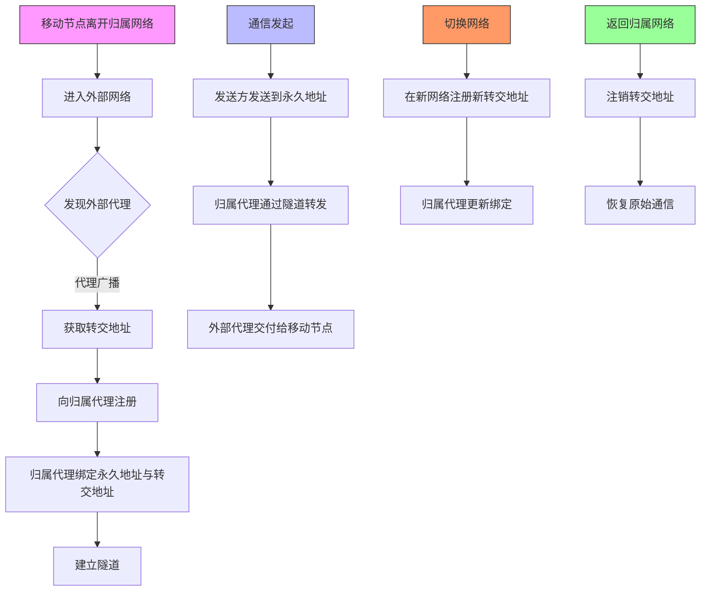

# 网络层概览
**网络层**（**N**etwork **L**ayer）是[[OSI七层模型|OSI模型]]中的第三层（[TCP/IP](https://zh.wikipedia.org/wiki/TCP/IP%E5%8D%8F%E8%AE%AE%E6%97%8F "TCP/IP协议族")模型中的网际层），提供[路由](https://zh.wikipedia.org/wiki/%E8%B7%AF%E7%94%B1 "路由")和寻址的功能，使两终端系统能够互连且决定最佳路径，并具有一定的拥塞控制和流量控制的能力。相当于发送邮件时需要地址一般重要。由于TCP/IP协议体系中的网络层功能由IP协议规定和实现，故又称IP层。

# IPV4协议
## IPv4 分组

### 分组结构
IPv4 分组由 **20~60字节的首部**和**最大65515字节的数据部分**组成。首部固定部分（20字节）包含核心控制字段，可变部分（0~40字节）用于扩展功能。

关键字段协同工作：
- 版本（4bit）标识IPv4/v6；
- 首部长度（4bit，×4B单位）决定首部大小（20~60B）；
- 总长度（16bit，×1B单位）定义分组总字节数；
- 标识+标志+片偏移 共同管理分片机制；
- TTL 控制分组生命周期，协议字段指示上层协议类型（如TCP/UDP）。

首部校验和仅校验首部，算法与UDP一致，校验失败则丢弃分组。

### 分片机制（MTU约束）

当分组长度超过下一跳链路 MTU（如以太网1500B）时，路由器或源主机触发分片：
1. 分片规则
    - 分片仅在终点主机重组，中途不重组
    - 每个分片均为独立IP分组（含完整首部）
    - 非末片数据长度必须为8B整数倍（因片偏移以8B为单位）
2. 字段协作
    - 标识符相同 → 标记同属原始分组
    - MF位：1=后续有分片，0=末片
    - DF位：1=禁止分片（触发ICMP错误）
    - 片偏移 = 原始数据位置 / 8

实例：3980B数据（MTU=1500B）
- 分片1：1480B数据（偏移0，MF=1）
- 分片2：1480B数据（偏移185×8=1480B，MF=1）
- 分片3：1020B数据（偏移370×8=2960B，MF=0）

### TTL与ICMP控制环
TTL（生存时间） 由源主机设置初始值（常为64/128），每经路由器减1：
- TTL=0 → 丢弃分组 + 向源端发送 ICMP超时报文（Type 11）
- ICMP 同步传递其他异常（如目的不可达、参数错误等）
此机制本质是网络层的故障熔断策略，防止分组因路由环路无限滞留。

### 核心计算与易错点

| 字段    | 计算规则                | 实例              |
| ----- | ------------------- | --------------- |
| 首部长度  | 值×4B                | 5 → 20B         |
| 总长度   | 直接字节数               | 1500 → 1500B    |
| 片偏移   | 值×8B = 原始数据位置       | 185 → 1480B位置   |
| 分片数据长 | 非末片需满足 长度 mod 8 = 0 | 1480B合规，1482B错误 |

注意：
1. 分片时仅复制原始首部，但更新标志/片偏移；
2. TTL归零时当前路由器负责发送ICMP，非终点；
3. 数据长度 = 总长度 - 首部长度（如总长48B、首部20B → 数据28B）。

## IPV4地址与NAT


## 子网划分与子网掩码
### 子网划分原理与作用
子网划分通过借用主机号高位比特作为子网号，将单一IP网络划分为多个逻辑子网。假设原主机号占 $n$ 位，借用前 $k$ 位作子网号，剩余 $n−k$ 位为主机号，可划分 $2^k$ 个子网（每个子网IP地址块大小相等）。
- 技术本质：提升IP地址利用率，优化网络管理（如隔离广播域）。
- 配置要求：
    - 子网内所有主机需配置 IP地址、子网掩码、默认网关。
    - 支持子网的路由器转发表需包含 目的网络号、子网掩码、转发接口。
- 默认子网掩码：
    - A类：`255.0.0.0`，B类：`255.255.0.0`，C类：`255.255.255.0`
- 子网划分公式

- 子网数 = 2k2k（kk = 子网号位数）
    
- 每子网可用地址数 = 2(n−k)−22(n−k)−2（nn = 原主机号位数）
### 主机发送IP数据报的流程
子网掩码是判断网络归属的核心工具，决定了数据报的下一跳方向
1. **判断同网段**：
    - 用本机**子网掩码**与**目的IP**逐位相与，结果与本机**网络前缀**比对。
    - **相同**：目的主机在同一网络，通过ARP获取目的MAC地址，直接封装帧发送。
    - **不同**：目的主机在外部网络，通过ARP获取**默认网关MAC地址**，封装帧发送至网关。

### 路由器转发IP数据报的流程
1. 校验与提取：校验首部，提取目的IP地址。
2. 查转发表：
    - 将目的IP与每条表项的子网掩码逐位相与，匹配目的网络号。
    - 遵循最长前缀匹配原则（如`166.1.128.0/17`优先于`166.1.0.0/16`）。
3. 转发决策：
    - 匹配成功：从对应接口转发（若入口=出口则丢弃，避免环路）。
    - 无匹配：走默认路由（目的网络号`0.0.0.0`，子网掩码`0.0.0.0`）。

注：路由器不重组分片，不修改IP源/目的地址（NAT除外）。

### 典型场景训练解析

**拓扑背景**：
- 学校网络：B类地址`166.1.x.x`，子网掩码`255.255.128.0`（`/17`），划分为2子网：
    - 子网0：`166.1.0.0/17`（主机H1~H2，网关`166.1.0.5`）
    - 子网1：`166.1.128.0/17`（主机H3~H6，网关`166.1.128.1`）
- 公司网络：C类地址`200.1.1.0/24`（主机H7~H8，网关`200.1.1.1`）。

| 训练场景        | 关键步骤                                                               |
| ----------- | ------------------------------------------------------------------ |
| H3→H6（同子网）  | 1. H3用掩码`255.255.128.0`判断H6在同一子网  <br>2. ARP获取H6 MAC，直发数据报         |
| H1→H3（跨子网）  | 1. H1判断H3在不同子网  <br>2. ARP获取网关`166.1.0.5`的MAC  <br>3. 路由器查表转至子网1接口 |
| H1→H7（校→公）  | 1. 学校路由器匹配`200.1.1.0/24`，转至ISP  <br>2. ISP路由转至公司网关                 |
| H7→H1（公→校）  | 1. ISP路由匹配`166.1.0.0/17`，转至学校网关  <br>2. 学校路由查表转至子网0                |
| H1→Internet | 1. 学校路由器无匹配，走默认路由`0.0.0.0/0`至ISP  <br>2. ISP路由转发至外部网络              |

### CIDR与子网掩码进阶
- CIDR表示法：`IP地址/前缀长度`（如`166.1.128.0/17`），替代传统子网掩码，支持路由聚合。
- 多级子网划分：
    - 例：B类地址`166.1.x.x`借2位子网号（`k=2`），划分4个子网：
        - 子网0：`166.1.0.0/18`，掩码`255.255.192.0`
        - 子网1：`166.1.64.0/18`
        - 子网2：`166.1.128.0/18`
        - 子网3：`166.1.192.0/18`
    - 主机号剩余14位，每个子网支持 214−2214−2 个主机地址。
路由表优化：使用CIDR可合并连续网络（如`166.1.0.0/16`覆盖所有子网），减少转发表项。

## CIDR、路由聚合、ARP、DHCP
## CIDR
因为传统 IP 地址分类（A/B/C/D/E）存在地址浪费、灵活性差等严重缺陷。诞生出CIDR 解决方案：
- 取消分类边界：IP 地址 = 网络前缀（可变长） + 主机号。
- 地址块表示法：`起始IP/前缀长度`（如 `128.14.32.0/21`）。
- 核心优势：按需分配任意大小地址块，提升利用率。
### CIDR 子网划分技术

### 定长子网划分
- 规则：从主机号借用固定 $k$ 位作子网号，生成 $2^k$ 个等大子网。
- 公式：
    - 子网数 = $2^k$
    - 每子网可用 IP 数 = $2^{(n-k)} - 2$（$n$=原主机号位数，减 2 排除全 0/全 1 地址）。

### 变长子网划分
- 规则：子网号长度可变，允许不同大小的子网共存。
- 应用场景：按需分配地址（如小办公室用小子网，数据中心用大子网）。
- 实现技巧：二叉哈夫曼树模型：
    - 根节点：原始 CIDR 块（如主机号占 $h$ 位）。
    - 分裂规则：左子树赋 0，右子树赋 1（深度决定子网前缀长度）。
    - 叶子节点：最终子网，深度需 ≤ $h-1$（最小子网保留 ≥2 位主机号）。

### CIDR 核心机制与约束
1. 主机号全 0/全 1 禁用：
    - 全 0 为网络地址，全 1 为广播地址，均不可分配设备。
2. 最小子网约束：
    - 点对点链路需至少 `/30` 子网（主机号 2 位，提供 2 可用 IP）。
    - 原因：单主机位（如 `/31`）无可用 IP（仅剩全 0/全 1）。
3. 路由聚合（超网）：
    - 合并连续子网缩短前缀（如 `166.1.0.0/18`+`166.1.64.0/18` → `166.1.0.0/16`）。
    - **优势**：大幅压缩路由表规模。

# IPV6协议
IPv6（Internet Protocol version 6）是下一代互联网协议，旨在解决 IPv4 地址耗尽问题，同时改进数据报处理效率和支持现代网络需求。IPv6 采用 128 位地址空间，提供了更大的地址容量，并优化了首部格式，支持快速处理和转发数据报。此外，IPv6 引入了流标签、扩展首部等新特性，支持服务质量（QoS）和即插即用功能。

## IPv6 的产生原因
IPv6 的诞生主要是为了解决 IPv4 地址空间不足的问题。32 位的 IPv4 地址空间已经分配殆尽，尽管通过 CIDR（无类别域间路由）和 NAT（网络地址转换）等技术暂时缓解了地址短缺问题，但这些方法只是权宜之计。IPv6 从根本上扩展了地址空间，同时改进了协议设计，提升了网络性能和安全性。

### 关键点
- IPv4 地址空间不足，IPv6 提供 128 位地址（约 3.4×10³⁸ 个地址）。
- IPv6 取消了 IPv4 中的校验和字段，简化了首部处理。
- 支持 QoS，优化网络延迟和阻塞问题。

## IPv6 数据报格式
IPv6 数据报由基本首部和有效载荷两部分组成。基本首部固定为 40 字节，简化了字段设计，提高了路由器的处理效率。有效载荷部分可以包含扩展首部和数据，长度不超过 65535 字节。

### 基本首部字段
1. 版本（4 位）：标识协议版本，固定为 6。
2. 优先级（8 位）：区分数据报的类别和优先级。
3. 流标签（20 位）：标识同一流的数据报，用于 QoS。
4. 有效载荷长度（16 位）：指示有效载荷的大小。
5. 下一个首部（8 位）：标识下一个扩展首部或上层协议。
6. 跳数限制（8 位）：类似 IPv4 的 TTL，防止数据报无限循环。
7. 源地址和目的地址（各 128 位）：标识发送方和接收方。

### 特点
- 路由器不对扩展首部进行检查，提高处理效率。
- 分片仅在主机进行，简化了路由器操作。

## IPv6 与 IPv4 的区别
IPv6 在设计上对 IPv4 进行了多项改进，以下是主要区别：
1. 地址空间：IPv6 地址从 32 位扩展到 128 位。
2. 首部简化：移除校验和字段，将可选字段改为扩展首部。
3. 分片机制：IPv6 只能在主机处分片，IPv4 可在路由器和主机处分片。
4. 即插即用：IPv6 支持自动配置，无需 DHCP。
5. QoS 支持：通过流标签实现资源预分配和优先级管理。
6. 首部对齐：IPv6 首部为 8 字节整数倍，IPv4 为 4 字节整数倍。
7. ICMPv6：新增“分组过大”等报文类型。

## IPv6 地址表示形式
IPv6 地址采用冒号十六进制记法，长度为 128 位，通常分为 8 组，每组 4 个十六进制数字。
### 表示方法
1. 一般形式：  
    `4BF5:A412:0216:FEBC:BA5F:039A:BE9A:2170`
2. 压缩形式：  
    连续为零的组可以用 `::` 代替，但只能使用一次。  
    例如：`FF05:0:0:0:0:0:0:B3` 压缩为 `FF05::B3`。

### 规则：
- 每组前导零可省略，如 `039A` 可写为 `39A`。
- 双冒号 `::` 表示连续的零组。

## IPv6 基本地址类型
IPv6 定义了三种基本地址类型，用于不同通信场景：
1. 单播（Unicast）：  
    一对一通信，可作为源地址和目的地址。
2. 多播（Multicast）：  
    一对多通信，仅作为目的地址。
3. 任播（Anycast）：  
    一对多中最近的一个通信，仅作为目的地址。

## IPv6 向 IPv4 过渡的策略
由于 IPv6 和 IPv4 不兼容，过渡阶段需要采用以下技术实现平滑迁移：
1. 双栈协议（Dual Stack）：  
    设备同时运行 IPv4 和 IPv6 协议栈，支持两种地址的通信。
2. 隧道技术（Tunneling）：  
    将 IPv6 数据包封装在 IPv4 数据包中，通过 IPv4 网络传输，到达目的地后再解封装。
### 示意图
```text
IPv6 网络 → IPv4 网络 → IPv6 网络  
（封装）    （传输）    （解封装）
```


# 网络层辅助协议

## 动态主机配置协议 DHCP

## 网络地址转换 NAT

## 地址解析协议 ARP

# 路由技术
路由协议是路由器之间交换网络拓扑信息、建立和维护路由表的通信规则。它们使路由器能够动态学习网络结构，自动计算最优路径，并适应网络变化。路由协议的核心目标是确保数据包能够高效、准确地从源主机传输到目的主机。
## 路由协议分类
### 1. 按作用范围分类

#### (1) 内部网关协议(IGP)

- **作用范围**：自治系统(AS)内部
    
- **主要协议**：
    
    - RIP (Routing Information Protocol)
        
    - OSPF (Open Shortest Path First)
        
    - IS-IS (Intermediate System to Intermediate System)
        
    - EIGRP (Enhanced Interior Gateway Routing Protocol)
        

#### (2) 外部网关协议(EGP)

- **作用范围**：自治系统之间
    
- **主要协议**：
    
    - BGP (Border Gateway Protocol)
        

### 2. 按算法类型分类

#### (1) 距离矢量协议
- 代表协议：RIP、EIGRP
- 特点：路由器只知道到达目的网络的跳数和方向

#### (2) 链路状态协议

- 代表协议：OSPF、IS-IS
    
- 特点：路由器掌握整个网络的拓扑结构
    

#### (3) 路径矢量协议

- 代表协议：BGP
    
- 特点：记录到达目的网络所经过的AS路径
    

## 主要路由协议详解

### RIP (Routing Information Protocol)
#### 基本特性
- 类型：距离矢量IGP
- 版本：RIPv1、RIPv2、RIPng(IPv6)
- 度量标准：跳数(最大15跳)
- 更新周期：每30秒广播更新
- 端口号：UDP 520

#### 工作原理
1. 路由器启动时初始化路由表
2. 定期向邻居发送完整路由表
3. 使用水平分割和毒性反转防止环路
4. 180秒无更新则标记路由不可达
5. 240秒后删除失效路由

#### 优缺点
- 优点：实现简单，配置方便
- 缺点：收敛慢，规模限制(15跳)

### OSPF (Open Shortest Path First)
#### 基本特性
- 类型：链路状态IGP
- 版本：OSPFv2(IPv4)、OSPFv3(IPv6)
- 度量标准：接口开销(基于带宽)
- 算法：Dijkstra最短路径优先
- 协议号：IP协议89

#### 关键概念
1. 区域划分：减少LSA泛洪范围
    - 骨干区域(Area 0)
    - 常规区域
2. 路由器类型：
    - 内部路由器
    - 区域边界路由器(ABR)
    - 自治系统边界路由器(ASBR)
3. LSA类型：1-7类，描述不同网络信息

#### 工作流程
1. 建立邻居关系(Hello协议)
2. 同步链路状态数据库
3. 计算最短路径树
4. 维护路由表

#### 优缺点
- 优点：收敛快，支持大规模网络
- 缺点：配置复杂，资源消耗大

### BGP (Border Gateway Protocol)

#### 基本特性
- **类型**：路径矢量EGP
- **版本**：BGP-4(支持CIDR)
- **端口号**：TCP 179
- **特点**：基于策略的路由

#### 关键属性
1. AS-Path：记录经过的AS序列
2. Next-Hop：下一跳路由器
3. Local-Pref：本地优先级
4. MED：多出口鉴别器
5. Community：路由标记

#### 工作流程
1. 建立TCP连接
2. 交换完整路由表(初始)
3. 增量更新(后续)
4. 保持活动消息维护连接

#### 优缺点
- 优点：高度可扩展，策略控制灵活
- 缺点：收敛慢，配置复杂

## 协议比较

|特性|RIP|OSPF|BGP|
|---|---|---|---|
|协议类型|距离矢量|链路状态|路径矢量|
|适用范围|AS内部|AS内部|AS之间|
|度量标准|跳数|开销|路径属性|
|收敛速度|慢(分钟级)|快(秒级)|慢(分钟级)|
|网络规模|小型(≤15跳)|大中型|超大型(Internet)|
|资源消耗|低|中高|高|

## 路由协议选择建议
1. 企业网络：
    - 小型：RIP
    - 中大型：OSPF
    - 多厂商环境：IS-IS
2. ISP网络：
    - 内部：OSPF或IS-IS
    - 互联：BGP
3. 数据中心：
    - 传统：OSPF
    - SDN环境：可能使用专有协议

## 实际配置注意事项
1. RIP配置：
    - 启用版本2(支持VLSM)
    - 关闭自动汇总
    - 配置被动接口
2. OSPF配置：
    - 合理规划区域
    - 配置路由汇总
    - 调整计时器需谨慎
3. BGP配置：
    - 正确配置AS号
    - 实施路由过滤策略
    - 配置路由反射器减少全连接

# 高级网络层技术

## IP多播
IP多播（组播）是一种高效的网络数据传输方式，它允许发送者将数据一次性发送给多个接收者，而不需要为每个接收者单独发送数据副本。这种方式特别适合视频会议、在线直播等一对多通信场景，能显著减少网络带宽消耗和服务器负载。IP多播使用D类地址（224.0.0.0～239.255.255.255）作为组播组标识，通过组播路由协议构建分发树，实现数据的高效传输。

### IP数据报的三种传输方式
#### 单播（Unicast）
- 特点：点对点传输，每个数据报单独发送到目标地址。
- 应用场景：普通网页浏览、文件下载等。
- 缺点：当需要发送给多个接收者时，效率低下。

#### 广播（Broadcast）
- 特点：点对多点传输，数据报发送到同一子网内的所有设备。
- 应用场景：ARP协议、DHCP协议等。
- 缺点：无法跨子网，且会干扰不需要接收数据的设备。

#### 组播（Multicast）
- 特点：点对多点传输，数据报仅发送一次，由路由器在必要时复制并分发。
- 应用场景：视频直播、在线会议等。
- 优点：高效利用带宽，支持跨子网传输。

### IP组播地址与硬件组播
#### IP组播地址
- 范围：D类地址（224.0.0.0～239.255.255.255）。
- 特点：
    - 只能用作目标地址，源地址必须为单播地址。
    - 不提供可靠交付，通常基于UDP协议。
    - 不生成ICMP差错报文。

#### 硬件组播
- MAC地址格式：以`01-00-5E`开头，后23位由IP组播地址的最后23位转换而来。
- 范围：`01-00-5E-00-00-00`到`01-00-5E-7F-FF-FF`。
- 过滤机制：主机在IP层进一步过滤不属于自己的组播数据报。

### IGMP协议与组播路由选择协议

#### IGMP协议（网际组管理协议）
- 作用：让路由器知道本地网络中是否有主机加入或退出某个组播组。
- 工作流程：
    1. 加入阶段：主机发送IGMP报文声明加入组播组，路由器将成员关系通知其他组播路由器。
    2. 维护阶段：路由器周期性探询主机，确认组播组的活跃状态。

#### 组播路由选择协议
- 目的：构建以源主机为根节点的组播转发树，避免环路。
- 常用算法：
    - 基于链路状态的路由选择。
    - 基于距离-向量的路由选择。
    - 协议无关的组播（PIM），分为稀疏模式和密集模式。

## 移动IP
移动IP技术允许移动设备在跨越不同网络时保持固定的IP地址，确保通信不中断。其核心是通过归属代理和外部代理协作，将数据报转发到移动设备的当前位置。移动IP广泛应用于移动办公、物联网等场景。
### 移动IP相关概念
#### 移动节点
- 具有永久IP地址的移动设备（如手机、笔记本电脑）。

#### 归属代理（Home Agent）
- 移动设备在归属网络中的代理，负责转发数据报到移动设备的当前位置。

#### 外部代理（Foreign Agent）
- 移动设备在外部网络中的代理，提供转交地址并协助通信。

#### 转交地址（Care-of Address）
- 移动设备在外部网络中的临时地址，用于接收归属代理转发的数据。

### 移动IP通信过程
1. 进入外部网络：
    - 移动节点获取转交地址，并通过外部代理向归属代理注册。
    - 归属代理绑定永久地址与转交地址，建立隧道。
2. 数据转发：
    - 发送方将数据报发送到移动节点的永久地址。
    - 归属代理通过隧道将数据报转发到转交地址。
    - 外部代理将数据报交付给移动节点。
3. 切换网络：
    - 移动节点在新网络注册新的转交地址，归属代理更新绑定信息。
4. 返回归属网络：
    - 移动节点注销转交地址，恢复原始通信方式。



### 网络层设备对比
#### 路由器
- 功能：连接不同网络层协议的网段，隔离广播域。
- 特点：基于路由表和转发表进行分组转发。

#### 网桥/交换机
- 功能：连接不同物理层或链路层协议的网段，隔离冲突域。
- 特点：基于MAC地址转发数据帧。

#### 集线器
- 功能：连接同一物理层协议的设备，无法隔离冲突域或广播域。
- 特点：简单广播所有数据。